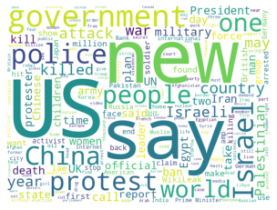
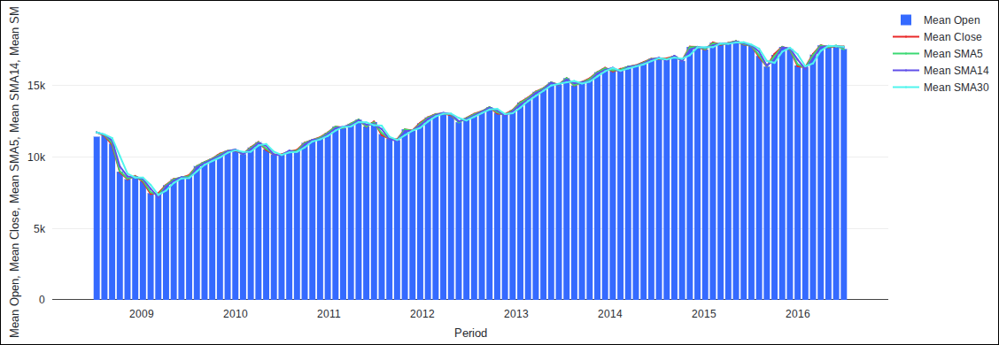
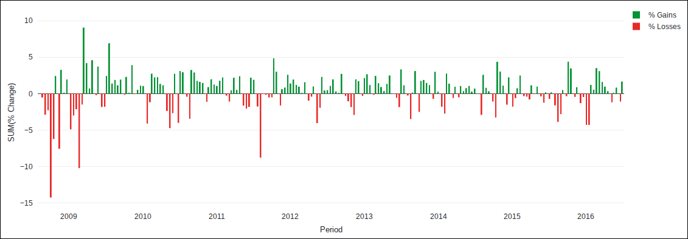
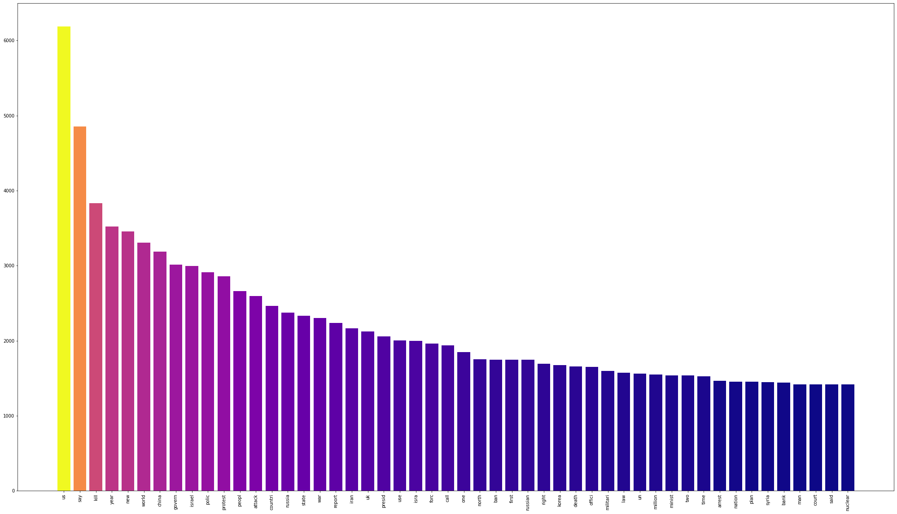
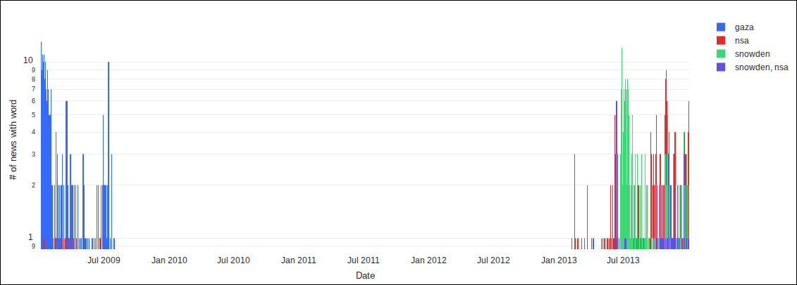
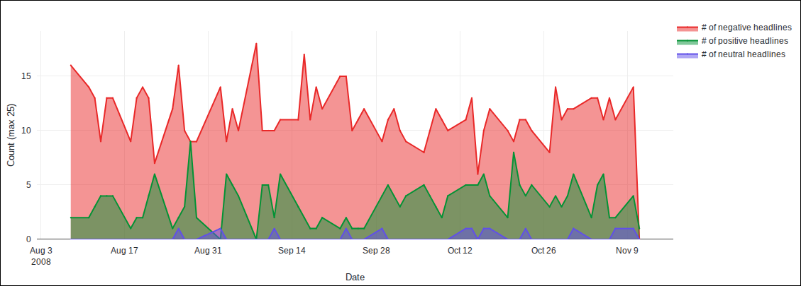
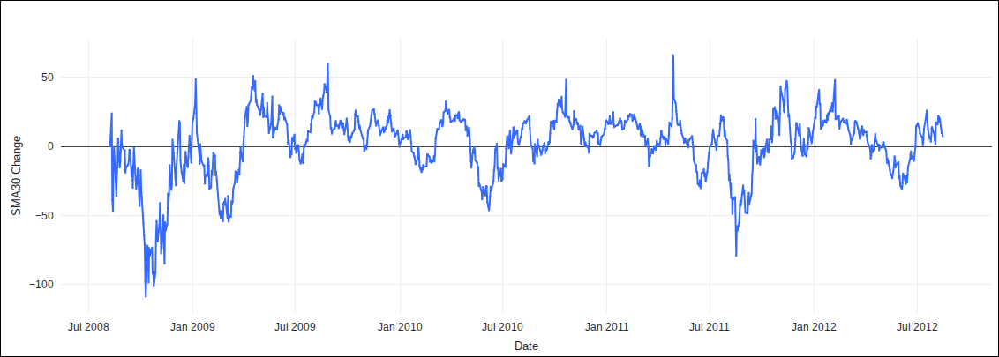

# 📈 Daily News & Stock Market Prediction with Apache Spark

> Can you read the headlines and beat the market? This project puts that question to the test — mining eight years of Reddit world-news headlines and Dow Jones data with **Apache Spark**, **NLP**, and **machine learning** to see whether daily news really moves the [DJIA](https://en.wikipedia.org/wiki/Dow_Jones_Industrial_Average).

<p align="left">
  
  
  
  
  
  
</p>

<p align="center">
  
  <br>
  <em>Eight years of world news, at a glance — the most frequent headline words (2008–2016).</em>
</p>

---

## Table of Contents

- [Overview](#overview)
- [Dataset](#dataset)
- [Tech Stack](#tech-stack)
- [The Notebooks](#the-notebooks)
- [Key Findings](#key-findings)
- [Selected Visuals](#selected-visuals)
- [Running It Yourself](#running-it-yourself)
- [Repository Structure](#repository-structure)
- [References](#references)
- [Author](#author)
- [Disclaimer & License](#disclaimer--license)

---

## Overview

Today's traders chase every available edge. This project asks whether *daily news sentiment and keywords* carry a measurable signal for the Dow Jones Industrial Average.

Across four notebooks it builds a full data-science pipeline on **Apache Spark**:

1. **Ingest & clean** — pull the dataset from Kaggle, enforce schemas, validate dates, and engineer market indicators (daily change, SMAs, volatility).
2. **Analyze** — explore DJIA performance and headline language (word frequencies, word clouds, headline length, sentiment over bull/bear periods).
3. **Test hypotheses** — formalize and statistically probe **seven hypotheses** about how news relates to price and volume.
4. **Stream** — demonstrate near-real-time scoring of incoming headlines with **Spark Structured Streaming**.

> **TL;DR of the results:** the relationship is mostly *noise*. Most hypotheses linking headline sentiment/keywords to price were **rejected or inconclusive** — a useful, honest reminder of how hard markets are to predict. See [Key Findings](#key-findings).

## Dataset

[**Daily News for Stock Market Prediction**](https://www.kaggle.com/datasets/aaron7sun/stocknews) by *Sun, J.* (Kaggle) — two aligned tables covering **2008-06 to 2016-07**:

- **News** — top-25 daily Reddit r/worldnews headlines.
- **DJIA** — daily Dow Jones open/high/low/close/volume.

## Tech Stack

| Area | Tools |
| --- | --- |
| Distributed processing | Apache Spark — Spark SQL, DataFrames, Window functions, **Structured Streaming** |
| NLP | NLTK (stop-words, Porter stemming), **VADER** sentiment analysis |
| Visualization | `wordcloud`, `matplotlib`, Databricks `display()` |
| Data | Kaggle API, Databricks DBFS |
| Platform | Databricks (PySpark notebooks) |

## The Notebooks

> ⚠️ The notebooks were authored on **Databricks** and use platform features (`dbutils`, DBFS, `display()`). Charts render on the Databricks platform and in the hosted HTML, **not** in GitHub's static notebook preview. Use the **HTML** or **nbviewer** links below to see the visuals.

| Part | Focus | View (HTML) | Notebook |
| ---- | ----- | ----------- | -------- |
| 1/4 | Ingest, clean & feature engineering | [HTML](./docs/part-1.html) | [nbviewer](https://nbviewer.org/github/andrejanesic/Spark-News-Stock-Market-Prediction/blob/main/Daily-News-And-Stock-Market-Correlation-Prediction-%281-4%29.ipynb) |
| 2/4 | Exploratory analysis (DJIA + headlines) | [HTML](./docs/part-2.html) | [nbviewer](https://nbviewer.org/github/andrejanesic/Spark-News-Stock-Market-Prediction/blob/main/Daily-News-And-Stock-Market-Correlation-Prediction-%282-4%29.ipynb) |
| 3/4 | Hypothesis testing (H1–H7) | [HTML](./docs/part-3.html) | [nbviewer](https://nbviewer.org/github/andrejanesic/Spark-News-Stock-Market-Prediction/blob/main/Daily-News-And-Stock-Market-Correlation-Prediction-%283-4%29.ipynb) |
| 4/4 | Spark Structured Streaming | [HTML](./docs/part-4.html) | [nbviewer](https://nbviewer.org/github/andrejanesic/Spark-News-Stock-Market-Prediction/blob/main/Daily-News-And-Stock-Market-Correlation-Prediction-%284-4%29.ipynb) |

> 💡 **Live version:** the rendered notebooks are published via **GitHub Pages** from the `/docs` folder (Settings → Pages → Source: `main` / `/docs`). Links between parts are document-relative, so they keep working even if the repository is renamed.

## Key Findings

Part 3 formalizes seven hypotheses and tests each against the data. The headline result: **headline language is a weak, inconsistent predictor of market behavior.**

| # | Hypothesis | Verdict | What the data showed |
| - | ---------- | ------- | -------------------- |
| **H1** | Specific words are more strongly tied to *gain* days than *loss* days | ❌ **Rejected** | In a random sample of 72 words, none showed a statistically significant gain/loss link. |
| **H2** | Different time periods surface different "mid-frequency" keywords (>100 uses, outside the global top 0.1%) | ✅ **Supported** | Clear period-specific spikes — e.g. *"gaza"* (2008–09 conflict) and *"snowden"* (2013 NSA leaks). |
| **H3** | Trending keywords (e.g. *gaza*, *snowden*) trigger higher trading volume | ⚠️ **Not general** | Some keywords (*sri*, *mumbai*, *iceland*) showed higher mean volume, but only within continuous windows — no general rule. |
| **H4** | Large price swings trigger DJIA-referencing headlines (*"dow"*, *"djia"*) | ❓ **Inconclusive** | Too few headlines directly reference the DJIA (only two) to draw a conclusion. |
| **H5** | Top non-top-1% keywords in a 14-day window correlate with the 14-day SMA | ✅ **Partial** | Words like *"iraqi"*, *"corrupt"*, *"agency"*, *"hack"*, *"crash"* aligned with larger SMA-14 moves. |
| **H6** | "Positive"-sentiment news correlates with a rising 30-day SMA | ❌ **Rejected** | No correlation between headline sentiment and 30-day SMA change. |
| **H7** | >50% of news on top-10% positive-change days concerns US internal affairs | ❌ **Rejected** | Most such headlines concerned other countries (UK, Russia, China, Israel). |

## Selected Visuals

**The market, 2008–2016**

<p align="center">
  
  <br>
  <em>Mean DJIA value with 5-, 14- and 30-day SMAs. The 2008 crash bottoms out near 7k before a long climb to ~17.7k — a strong upward bias the models have to be evaluated against.</em>
</p>

<p align="center">
  
  <br>
  <em>Daily percentage change — gains (green) vs. losses (red). The deep red bars of late 2008 (≈ −14%) mark the financial crisis; volatility clusters in 2008–09 and 2011.</em>
</p>

**What the headlines talk about**

<p align="center">
  
  <br>
  <em>The 50 most frequent (stemmed) headline words. The corpus skews heavily toward geopolitics — <code>us</code>, <code>china</code>, <code>israel</code>, <code>russia</code>, <code>war</code>, <code>attack</code>.</em>
</p>

<p align="center">
  
  <br>
  <em>Period-defining keywords on a log scale (<strong>H2–H3</strong>): <code>gaza</code> dominates the 2008–09 Gaza War, while <code>snowden</code>/<code>nsa</code> spike in mid-2013 around the NSA leaks — clear evidence that different periods surface different vocabulary.</em>
</p>

**Sentiment & signal**

<p align="center">
  
  <br>
  <em>Headline sentiment during the 2008 financial crisis (Aug–Nov 2008). Negative headlines (red) overwhelm positive (green) and neutral (purple) throughout the period.</em>
</p>

<p align="center">
  
  <br>
  <em>Daily change in the 30-day SMA, 2008–2012 (<strong>H6</strong>). Tested against headline sentiment, no correlation emerged — positive news did not foreshadow a rising 30-day average.</em>
</p>

> Part 4 (Structured Streaming) produces no static charts — its output is a live in-memory table whose row count grows as headlines stream in. See the [HTML export](./docs/part-4.html) for the streamed results.

## Running It Yourself

These notebooks target **Databricks** and won't run unmodified in a plain Jupyter environment (they rely on `dbutils`, DBFS paths, and Databricks' `display()`).

**On Databricks (as authored):**

1. Import the `.ipynb` files into a Databricks workspace (one cluster, parts run in order).
2. Get a free **Kaggle API token** — [Kaggle account](https://www.kaggle.com/account/login) → *Account* → *Create New API Token* — and paste the contents of `kaggle.json` into the "Kaggle API token:" prompt in Part 1.
3. Run Part 1 → 4 in sequence; each part loads the data the previous one saved to DBFS.

**Locally (adaptation needed):** install the dependencies in [`requirements.txt`](./requirements.txt), then swap `dbutils`/DBFS calls for local paths and `display(df)` for `df.show()` / `df.toPandas().plot()`.

## Repository Structure

```
.
├── assets/                          # README images
├── docs/                            # Rendered HTML exports (GitHub Pages source)
│   ├── part-1.html … part-4.html
│   └── .nojekyll
├── Daily-News-And-Stock-Market-Correlation-Prediction-(1-4).ipynb
├── Daily-News-And-Stock-Market-Correlation-Prediction-(2-4).ipynb
├── Daily-News-And-Stock-Market-Correlation-Prediction-(3-4).ipynb
├── Daily-News-And-Stock-Market-Correlation-Prediction-(4-4).ipynb
├── requirements.txt
├── LICENSE
└── README.md
```

## References

1. Sun, J. (2016). *Daily News for Stock Market Prediction*, Version 1. Kaggle. https://www.kaggle.com/datasets/aaron7sun/stocknews
2. Barve, S. (2022). *Easy way to use Kaggle datasets in Google Colab.* https://www.kaggle.com/general/51898#1884104
3. Levi, J. (2020). *Bar chart in matplotlib using a colormap.* https://stackoverflow.com/a/64068828
4. Wikipedia. *Gaza War (2008–2009).* https://en.wikipedia.org/wiki/Gaza_War_(2008%E2%80%932009)
5. Greenwald, G. et al. (2013). *Edward Snowden: the whistleblower behind the NSA surveillance revelations.* The Guardian.

## Author

**Andreja Nesic** — [andrejanesic.com](https://andrejanesic.com)

## Disclaimer & License

This project is a **demonstration for academic and educational purposes only** and is **not** intended for trading or investment decisions. Use caution with your own money — the author accepts **no liability** for any financial or other damage arising from use of this software.

Released under the [MIT License](./LICENSE).
